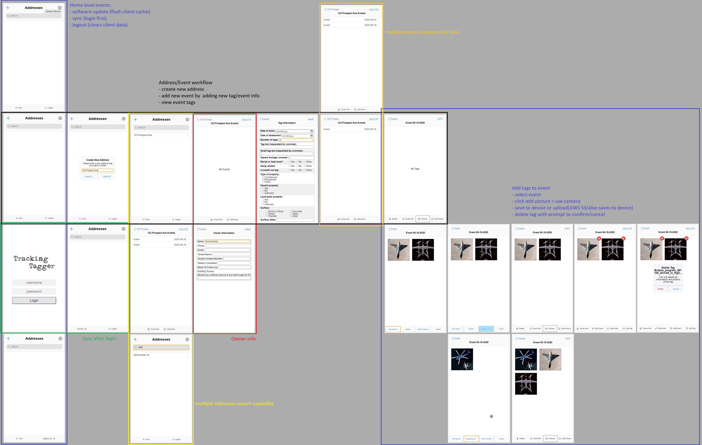
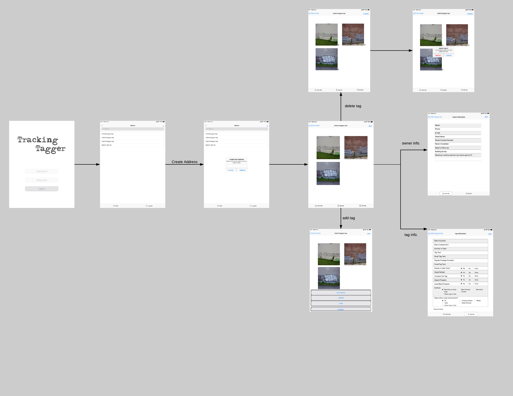

# Tagging Tracker React Native
A React Native version of the [PWA MVP](https://github.com/codeforkansascity/tagging-tracker-pwa).

## About
This is an app I'm contributing to for [CodeforKC](https://codeforkc.org/). The purpose of the app is to track areas of graffiti(gather address, take pictures, get info such as owner of building, etc...) then remove the graffiti(abatement).

I made a PWA MVP and now I'm turning it back into an RN app. Main reasons are the lack of a file system and trying to develop an iPhone app which means I don't have to deal with the bottom navbar like Safari. Mostly though it is the file system, I stored the images in the PWA version with `base64` which it does work, but it's also a lot of data(huge strings). There are requirements for this app to work offline first and then have remote upload/sync capability.

This project has history, I wanted to get it launched right away... it took me a bit longer than I thought. The prototype based on the first mock up took me just over 2 weeks to develop but we decided to update the workflow, covid happened, and I generally lost steam.

## Workflow
This is the current workflow as opposed to the original. I made the mistake of designing the PWA in such a way where every screen was rendered using a route wrapper and multi-functionality components eg. the banner has 11 versions based on route... that was a mistake, should have used screens with base components making up each screens. There are other nasty side hacks that I implemented as I was developing this/didn't see beforehand so I'll address them in this version. Generally related to state management.

Current workflow

Previous workflow

# Capabilities
- client
  - creation of addresses/events/storage of images
- remote
  - login
  - sync up/down

# Run app
Clone this repo, then cd into it, should be able to just do `npm install`. To run the app you have to cd into the RN app eg. `TaggingTracker` which as its own `package.json` file eg. has the start scripts.